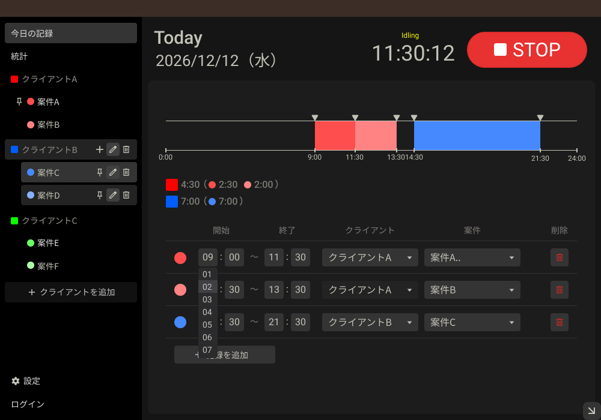

# work-timer-extension(仮)

**フリーランスのための、クライアント別・案件別の作業時間トラッカー（Chrome拡張機能）**

STARTを押すだけで作業時間を記録し、「どのクライアントの、どの案件に、何時間使ったか」を可視化します。席を離れたら自動で止まり、記録は後から修正できます。

> 🚧 開発中です。実装済みの機能と、これからの予定は下記にまとめています。

## なぜ作っているか

フリーランスとして仕事をしていると実際どの案件に何時間使ったのかを正確に測ることが案外難しいです。
作業開始時間も日によってまちまちなため、開始時間をメモし忘れたり、休憩時間が曖昧になることが多々ありました。
作業時間を記録してくれるアプリもありますが、いまいち内容が複雑だったり使いにくかったりしたため、自分で作ることにしました。
ちょうどReactを習得中だったこともあり、実戦で学びながら進めるのに最適な題材でした。

## 主な機能（実装済み）

- **ワンクリック計測**：START / STOP、案件の切り替えに対応
- **自動アイドル検知**：一定時間操作がないと作業を確定して一時停止し、操作再開で新しい作業として記録を再開
- **自動終了**：放置された計測を一定時間後に自動で終了
- **クライアント / 案件の管理**：追加・リネーム・削除（確認モーダル付き）、色の重複回避
- **今日の記録画面**
  - 0:00〜24:00のタイムライン表示
  - クライアント別 → 案件別の内訳（`4:30` 形式）
  - 記録の開始・終了時刻を、時と分のプルダウンで編集（不正な値は警告表示）
  - 記録の削除
  - クライアント・案件の変更
  - 現在記録中の場合はその記録を表示（編集は不可）
  - 記録の追加（デフォルトの案件を1分の作業として追加）
  - クライアントカラーの変更
- **小窓 / 大窓の切り替え**：作業中は邪魔にならないよう小さく、確認や編集のときは大きく

## これから

- [ ] 統計画面（StatsTab）
- [ ] ログイン機能

## 技術スタック

| 分類 | 内容 |
|---|---|
| UI | React + TypeScript + Vite |
| 拡張機能 | Chrome Extension（Manifest V3） |
| スタイル | SCSS（FLOCSS設計） |
| データ保存 | `chrome.storage.local` |
| 計測制御 | `chrome.idle` / `chrome.alarms` / `chrome.runtime.onMessage` |

## 開発ログ

docs/devlog.md
Zenn:https://zenn.dev/kengohidaka
X:https://x.com/Keng0_026

## お仕事のご相談

Chrome拡張機能、React / TypeScriptでのWebアプリ開発のご相談をお受けしています。

ポートフォリオ:https://with-kengo.com/
メール:kengo.hidaka.26z@gmail.com

## ライセンス
